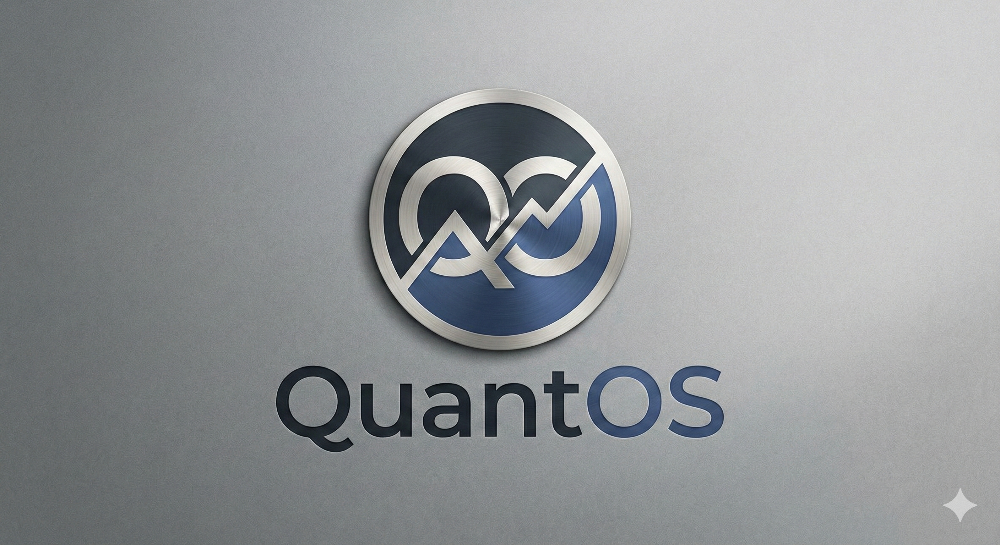

  
  <h1>QuantOS v9.5: Midnight Edition</h1>
  
<strong>The Professional Algorithmic Trading Suite for Retail Investors.</strong>

---

### 🚀 What's New in v9.5
* **High-Octane Engine:** Now tracking NVDA, Tesla, and Bitcoin Proxies (MSTR/COIN).
* **Self-Healing Launcher:** Automatically finds open ports (5000-5010) and prevents crashes.
* **Smart Data:** Automatically switches between IBKR and Alpaca for market data.
* **Navy & Silver UI:** A completely redesigned, professional dashboard.

### 📦 How to Install (Zip Method)
1.  **Unzip** this folder to your Desktop.
2.  **Double-click** `start.bat`.
3.  **Wait** for the initialization (First run takes ~2 mins to download AI models).
4.  The Dashboard will automatically open in your browser.

### 🔑 Configuration
* Open the `QuantOS` folder.
* Rename `.env.example` to `.env`.
* Open `.env` with Notepad and add your **IBKR Account ID** or **Alpaca Keys**.

### ⚠️ Disclaimer
This software is for educational purposes only. Algo-trading carries risk.
